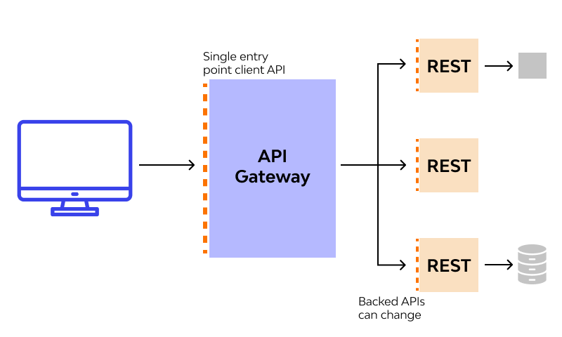
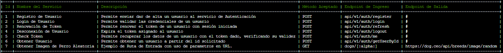

[![MIT License][license-shield]][license-url]
[![LinkedIn][linkedin-shield]][linkedin-url]

 

  

<h3 align="center">Docker Api Gateway</h3>

  

    Api Gateway desarrollado en Laravel y MySQL .
     
    <a href="https://github.com/ricurdinola/docker-api-gateway"><strong>Explorar el repo »</strong></a>
     
     
    <a href="https://github.com/ricurdinola/docker-api-gateway/issues">Reportar un Bug </a>
    ·
    <a href="https://github.com/ricurdinola/docker-api-gateway/issues">Sugerencias </a>
  

## Sobre el Proyecto
El proyecto busca desarrollar un Api Gateway sencillo de administrar que se consituya como único ingreso 
de los distintos endpoints que se pudieran definir, permitiendo homogeneizar sus url y brindando flexibilidad en los servicios backend.

Se encuentra desarrollado con [Laravel](https://www.laravel.com/) y [MySQL](https://www.mysql.com/)
utilizando [Docker](https://www.docker.com) como gestor de contenedores.

<a href="#top">Ir al Inicio</a>

### Descripción del Stack

    
    
    

El stack se compone de los siguientes elementos:

* Un servidor web Apache con PHP 8. Por defecto, se utiliza la imagen oficial de PHP: php:8-apache
* Se incorporó Laravel en su version 8.
* La gestión de dependencias mediante composer se encuentra integrada al servidor web por lo que no es necesaria su instalación en el entorno local.
* Por último, se inicia un contendor de Base de Datos: [MySQL 8.0](https://www.mysql.com/)

<a href="#top">Ir al Inicio</a>

## Utilizando el Stack
A continuación, se describe brevemente la utilización del proyecto.

### Pre-requisitos
Solo es necesario tener instalado el [Docker](https://www.docker.com/products/docker-desktop) y el [Docker Compose](https://docs.docker.com/compose/install/)

### Estructura de Archivos
* `/mysql` Contiene el _Dockerfile_ de MySQL y la carpeta de datos de la base de datos.
* `/web-server` Contiene el _Dockerfile_ del servidor web. Si necesitas instalar una extensión del
  php o incorporar una librería, vas a tener que modificar el archivo de esta carpeta.
* `/web-server/config` Contiene los directorios de configuración de Apache y PHP. Los archivos de
  configuración de esta carpeta se copian al contenedor al momento de generarlos. Si se modifican, será necesario
  regenerar los contenedores.
* `/web-server/www/` Es la carpeta para los archivos Web. Es donde se encuentra la aplicación del Gateway.

### Configurar el ambiente de desarrollo
En el directorio raíz, existe un archivo .env, el cual contiene los siguientes parámetros configurados.

#### Stack Options
* `COMPOSE_PROJECT_NAME`: Es el nombre del stack de contenedores que se generarán.

#### PHP-Apache Options
* `WEB_WERVER_NAME`: El nombre que le daremos al contenedor del servidor Web.
* `PHP_PORT`: El puerto por medio del cual se accederá al contenedor web.
* `PHP_VERSION`:  versión de PHP que se va a utilizar. Por defecto, se utiliza la versión 8. Se pueden
  ver más [versiones disponibles](https://github.com/docker-library/docs/blob/master/php/README.md#supported-tags-and-respective-dockerfile-links)

#### DB Options
* `DB_SERVER_NAME`: El nombre que tendrá el contenedor MySQL.
* `MYSQL_VERSION`: Versión de MySQL que se va a instalar.
* `MYSQL_DATABASE`: Nombre de la base de datos a generar en el contenedor.
* `MYSQL_USER`: Usuario por defecto a generar durante la instalación del contenedor.
* `MYSQL_PASSWORD`: La contraseña del usuario generado.
* `DB_ROOT_PASSWORD`: La contraseña de root.
* `DB_PORT`: Puerto en el cual se publicará la Base de Datos.

### Instalar el ambiente de desarrollo
Una vez cambiado los parámetros deseados, se debe ejecutar el archivo `build.sh`

### Configurar el .env
Una vez finalizado la generación del contenedor, se deberá configurar la aplicación del Gateway.
* Copiar el archivo www/.env.example a un archivo /www/.env.
* Configurar el .env. Al menos las opciones APP_ y DB_. Tener en cuenta que si se cambiaron los nombre del contenedor MySQL se deberá modificar este archivo para apuntar al contenedor correcto.
* Como nos encontramos dentro del stack de docker, en DB_HOST se puede ingresar el _nombre del contenedor y el puerto real_ (no el publicado en la máquina host).
  Ej:
  `DB_CONNECTION=mysql`
  `DB_HOST=db`
  `DB_PORT=3306`
  `DB_DATABASE=laravel`
  `DB_USERNAME=user`
  `DB_PASSWORD=1234`

### Ejecutar Comandos desde el contenedor. (dev)
Una vez instalado y levantado los contenedores, ingresar al contenedor y ejecutar los siguientes comandos:
* `composer install`: Descarga las dependencias de la carpeta vendor que no forman parte del repositorio.
* `php artisan key:generate`: Genera la App Key en el .env
* `php artisan storage:link`: Genera el Link Simbólico
* `php artisan migrate`: Crea las Tablas Básicas del Sistema
* `php artisan db:seed`: Inicializa los datos con los servicios propios del gateway y el usuario Administrador

#### Permisos
Si estas montando este contenedor en el WSL, puede ocurrir que tengan problemas de permisos entre el usuario del WSL y el usuario de los contenedores.
Si es necesario, se deben ejecutar los siguientes comandos desde el terminal de la máquina host (correrlo desde el directorio _www_):
* sudo chown [owner]:www-data storage -R
* sudo chmod 775 storage -R
* sudo chown www-data:www-data bootstrap/cache -R

<a href="#top">Ir al Inicio</a>

### Uso del Gateway

El gateway recibirá las peticiones entrantes y las redirigirá al destino configurado
Cada endpoint que se quiera consumir, deberá ser dado de alta, al igual que los clientes que podrán realizar las solicitudes.
Cada cliente deberá tener una o varias Keys generadas, las cuales podrán ser asignadas a uno o más servicios.

Para la administración de la configuración, se deberá ingresar al contenedor y hacer uso de la consola de artisan.
Los comandos disponibles se encuentran bajo el grupo gateway:

* `gateway:createService` => Inicia el proceso de registrar un servicio. Se solicita el ingreso de los datos de manera interactiva.
* `gateway:showServices` => Lista los servicios registrados y que pueden ser consumidos.
* `gateway:createClient {name}` => Da de alta un cliente. Es obligatorio pasarle un nombre.
* `gateway:showClients` => Lista los clientes registrados en el api gateway.
* `gateway:createApiKey` => Genera una clave API para un cliente. Se listarán los clientes disponibles y se solicitará que se seleccione a quien asignar la key generada.
* `gateway:showClientKeys {client_id?}` => Muestra las Apis Keys asignadas a los clientes o al Id de cliente especificado (opcional).
* `gateway:assignService` => Inicia el proceso interactivo en el cual se seleccionará el servicio que se desea habilitar y se deberá ingresa el Id de la api key del cliente a quien relacionarlo. (Es el id mostrado en el comando showClientKeys)

<B> Servicios básicos configurados </B>

 El gateway viene con servicios básicos que permiten registrar usuarios para las aplicaciones, generar Token JWT entre otros servicios.

 A continuación, se listan los servicios básicos habilitados para el cliente Administrador

<a href="#top">Ir al Inicio</a>

## Licencia
Distribuido bajo Licencia MIT. Para más información, ver el archivo
[LICENSE](https://github.com/ricurdinola/docker-api-gateway/blob/main/LICENSE)

<a href="#top">Ir al Inicio</a>

## Contacto
Ricardo Urdinola - ricurdinola@gmail.com - [Mis Repositorios](https://github.com/ricurdinola?tab=repositories)

<a href="#top">Ir al Inicio</a>

## Agradacimientos
El conocimiento y las herramientas se contruyen sobre la base y el trabajo de la comunidad.
Es por eso que agradecemos a los colaboradores que mantienen los siguientes recursos.

* [Best Readme Template](https://github.com/othneildrew/Best-README-Template)
* [Img Shields](https://shields.io)
* [Docker](https://www.docker.com/)
* [Composer](https://getcomposer.org/)
* [Apache](https://httpd.apache.org/)
* [PHP](https://www.php.net/)
* [Laravel](https://www.laravel.com/)
* [MySQL](https://www.mysql.com/)

<a href="#top">Ir al Inicio</a>

[license-shield]: https://img.shields.io/github/license/ricurdinola/docker-api-gateway?style=for-the-badge

[license-url]: https://github.com/ricurdinola/docker-api-gateway/blob/main/LICENSE

[linkedin-shield]: https://img.shields.io/badge/-LinkedIn-black.svg?style=for-the-badge&logo=linkedin&colorB=555

[linkedin-url]: https://www.linkedin.com/in/urdinolaricardo/
